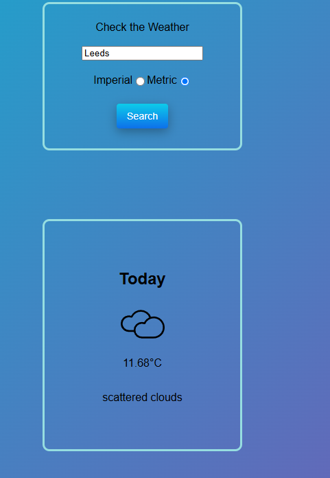

## Introduction

This is a simple weather web app that displays the current temperature based on user-provided city input. It’s hosted on [Render](https://render.com/) and uses an API key from [OpenWeather](https://openweathermap.org/city/2643743).

I’ve also built a similar [CLI version](https://github.com/Dendop/Leetcode-practice/tree/main/weather_cli_app) that runs in the terminal on a local machine.

---

## Usage

Enter a city name in the input field, and the app will display:
- Temperature  
- Weather description  
- Corresponding weather icon

---

## How it Works

- [main.js](https://github.com/Dendop/weather-app/blob/main/main/static/js/main.js) handles the city input and units, then sends a POST request to the [Flask backend](https://github.com/Dendop/weather-app/blob/main/main/__init__.py).
- Flask sends a request to the OpenWeather API using a stored secret API key and retrieves JSON weather data.
- The backend processes the data (including choosing an icon based on `weather_id`) and sends it back to the frontend.
- The result is displayed via [layout.html](https://github.com/Dendop/weather-app/blob/main/main/templates/layout.html).

---

## Requirements

Dependencies are listed [here](https://github.com/Dendop/weather-app/blob/main/requirements.txt).  
To install them, run:

```bash
pip install -r requirements.txt
```
### Screenshot:

